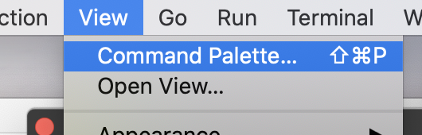

# Setting up a new project

## Setting up a project structure

1. cd to a folder where you want to create your project folder (should not be a git repo)
2. pip install cookiecutter
3. cookiecutter gh:patrickmineault/true-neutral-cookiecutter
    a. Decide on a project and repo name that make sense for one of your projects. package_name can be src
4. Will create a new folder called <repo_name>, open that as a new VSCode window
5. Explore - what do you think will go where? Do you like this structure?
6. Try creating a function in src then using it in scripts

## Connecting to git repo (optional)

Option 1 (VSCode GUI):
1. Go to Git sidebar option
2. Click Publish to Github
3. If you run into permission issues, you may need an ssh key: https://docs.github.com/en/authentication/connecting-to-github-with-ssh/generating-a-new-ssh-key-and-adding-it-to-the-ssh-agent

Option 2 (command line):
1. Create github repo with same name as your local repo
Locally:
2. Add a README.md 
3. Run the following commands. For me, this worked in 
git init
git add README.md
git commit -m "first commit"
git branch -M main
git remote add origin https://github.com/yourusername/yourgitreponame.git
git push -U origin main
4. If you run into permission issues, you may need an ssh key: https://docs.github.com/en/authentication/connecting-to-github-with-ssh/generating-a-new-ssh-key-and-adding-it-to-the-ssh-agent

## Creating a virtual environment

1. Create your virtual environment
conda create --name <repo_name> python=3.9
conda activate <repo_name>

2. Install things you need
pip install -e . (will set up local version of your package)
pip install ipykernel
pip install anything else you need
 
3. Set up a jupyter notebook kernel version of your virtual env
python -m ipykernel install  --user --name <repo_name>

4. Select this virtual env on VSCode
    1. Open command palette with View -> Command Palette
        
    2. Search for Python: Select Interpreter and then choose your virtual environment
    3. Check it works in jupyter notebook (create .ipynb file). Your kernel should show up in top right corner. Try running a cell with basic code in

	
